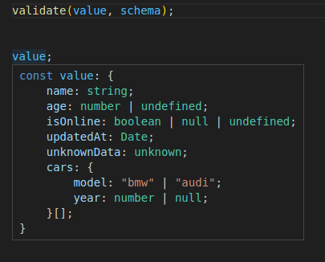

# vator

[![NPM][npm-img]][npm-url]
[![Build][build-img]][build-url]
[![Coverage][coverage-img]][coverage-url]
[![License][license-pic]][license-url]

Assert validator for TypeScript projects.

## Installation

```bash
npm install vator
```

## Usage

```js
// ESM or TypeScript projects:
import { v, validate, buildSchema, is } from 'vator';

// CommonJS projects:
const { v, validate, buildSchema, is } = require('vator');
```

## Examples

### 'is'

`is` is a collection of shortcuts for comparing types of values.
The regular `if (a === undefined) ...` can be replaced with
`if (is.undefined(a)) ...` and so on.

Designed to be used in conditions, because it uses `type guard` approach.

```ts
const maybeNumber = Math.random() > 0.5 ? 10 : null;

if (is.number(maybeNumber)) {
  // TS will not complain, because maybeNumber is number already
  console.log(maybeNumber + 10); // 20
} else {
  console.log(maybeNumber === null); // true
}
```

Available `is` validators:

```ts
is.undefined();
is.null();
is.nullable();
is.string();
is.number();
is.email();
is.phone();
```

### Primitives with 'validate'

Will validate that `value` is a string type:

```ts
const value = 'some';

validate(value, v.string);
```

Will throw an error if value is not matching the type:

```ts
const value = 22;

validate(value, v.string);
```

Error:

```log
Validation failed: value has type 'number', but 'string' type is required.
```

### Objects and Arrays with 'validate'

Will validate that `value` is an object with described fields.
Also it's more convenient to use `buildSchema` helper to get `schema` and `ResultType`.

> **Note**
>
> `ReturnType` is an empty object, only refers to valid result type!.

```ts
// Let's pretend that 'value' is 'unknown' type
const value: unknown = {
  name: 'some-name',
  age: 100,
  isOnline: false,
  updatedAt: '2023-05-22T14:32:34.324Z',
  unknownData: [2, 'foo', false]
  cars: [
    {
      model: 'bmw',
      year: 2017
    },
    {
      model: 'audi',
      year: null
    }
  ]
};

const { schema, ResultType } = buildSchema({
  name: v.string,
  age: v.optional.number,
  isOnline: v.maybe.boolean,
  updatedAt: v.Date,
  unknownData: v.unknown,
  cars: v.array(v.object({
    model: v.literal('bmw', 'audi'),
    year: v.nullable.number
  }))
});

validate(value, schema)
```

Also `value` will then have valid types (because `validate()` asserts them)



[npm-img]: https://img.shields.io/npm/v/vator.svg?logo=npm
[npm-url]: https://www.npmjs.com/package/vator
[build-img]: https://img.shields.io/github/actions/workflow/status/andr-ii/vator/build.yml?logo=github
[build-url]: https://github.com/andr-ii/vator/actions/workflows/build.yml
[coverage-img]: https://img.shields.io/coverallsCoverage/github/andr-ii/vator?label=coverage&logo=jest
[coverage-url]: https://coveralls.io/github/andr-ii/vator?branch=master
[license-pic]: https://img.shields.io/github/license/andr-ii/vator?color=blue&label=%C2%A9%20license
[license-url]: https://github.com/andr-ii/vator/blob/master/LICENSE
